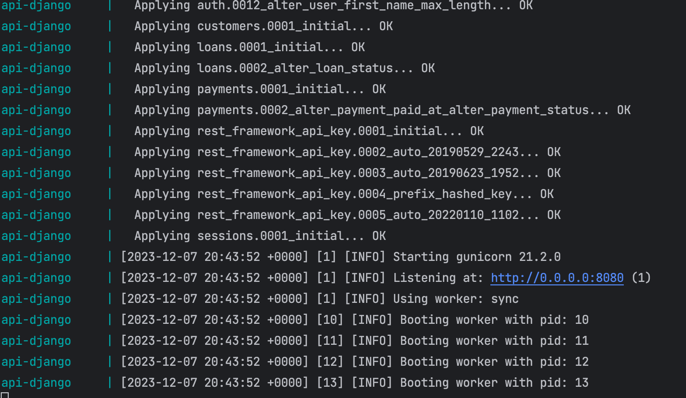

# api-mo-technologies
Api technical assessment

The IT project includes a technical assessment for MO Technologies. It is a REST API built with Django Rest Framework

## Prerequisites

- Docker
- Docker Compose

## ✅ Main Requirements to inspect or developing

1. PyCharm 2022.1.3 (Community Edition)
2. Python (versio 3.9-5)
3. pip
4. Django-Rest-Framework


## ⬇️ Instructions

1. Once configured your SSH key with open-ssh and configured your key at github setting (More info: https://docs.github.com/es/authentication/connecting-to-github-with-ssh/adding-a-new-ssh-key-to-your-github-account):
```bash
git clone git@github.com:daviidco/api-mo-technologies.git
```
2. Navigate to the cloned repository directory:

```bash
cd techinical_test
```

3. Build and run the services with Docker Compose:

```bash
docker-compose up --build
```

On your console you must view somthing like:


Now you can do test to Api here http://0.0.0.0:8080/swagger  ☺️


4. Stop and remove the services and volumes

To stop and remove the services, volumes, and networks created by Docker Compose, run the following command:

```bash
docker-compose down --volumes
```

4. Login in admin site http://0.0.0.0:8080/swagger  
```bash
user: user
password: password
```
The credentials are specicy at docker-compose.yaml as environment vars and there are executed from entrypoint.sh

----------
### ⚙️ Configure Api

### Environment

Once created virtual environment poetry, install dependencies poetry from requirements.txt from terminal
from backend directory

Use pip on virtual environment:
```
pip install -r requirements.txt
```

### 🐘 Database

1. Check version PostgreSQL on your laptop:
```
psql –version
```
Or
```
psql –V
```

If you have a version postgreSQL installed you should have some like this:

```
psql (PostgreSQL) 14.3
```

2. Log into PostgreSQL
```
psql postgres
```

3. Create database:

```
postgres=# create database name_new_db;
```

Don't forget typing name database.

3. Create user. This step is optional. you can use the user created previously.

```
postgres=# create user new_user with encrypted password 'mypass';
```

Don't forget typing name user and password


4. Granting privileges on database:


```
postgres=# grant all privileges on database name_new_db to new_user;
```

## ▶️ Run API
Ensure setting database connection at settings.py. Some like:
```python
DATABASES = {
     'default': {
         'ENGINE': 'django.db.backends.postgresql',
         'NAME': 'loandsdb', #change it databasename
         'USER': 'usertest', #change it database user name
         'PASSWORD': 'mypass', # change user database password
         'HOST': 'localhost',
         'PORT': '5432',
     }
}
```
Now from terminal:

Crate migrations
```
pytnon manage.py makemigrations
```

Apply mirgrations to database
```
pytnon manage.py migrage
```

Run Api from technical_test directory:
```
pytnon manage.py runsever
```

END 🥳	
